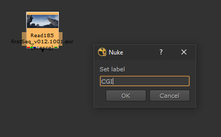
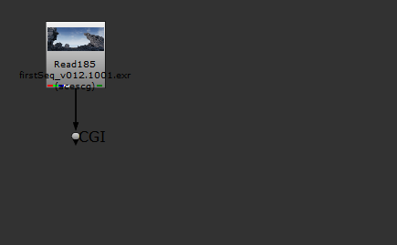
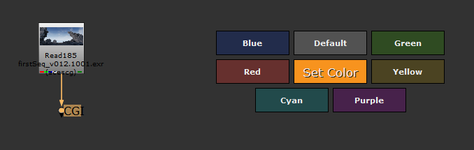
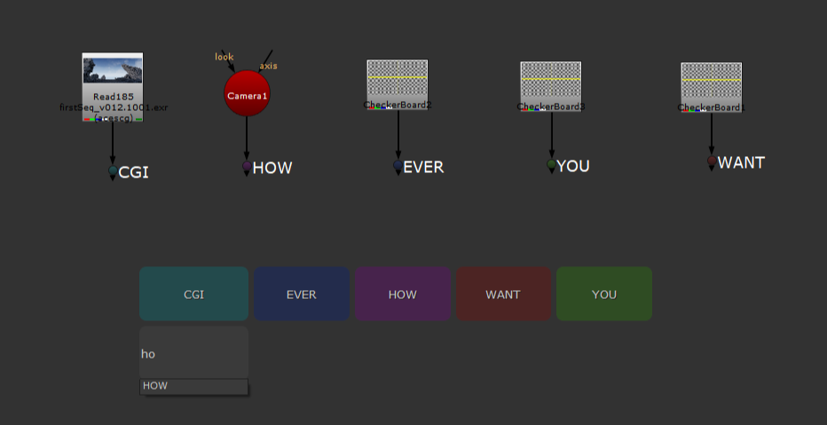
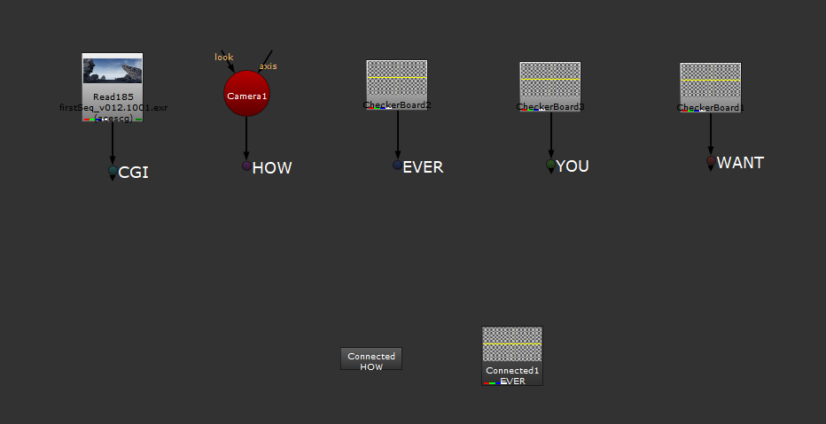
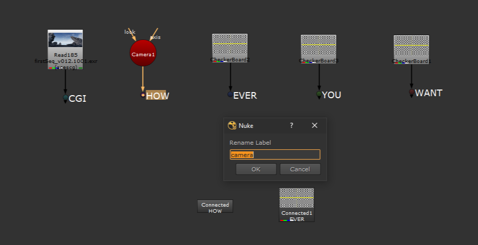
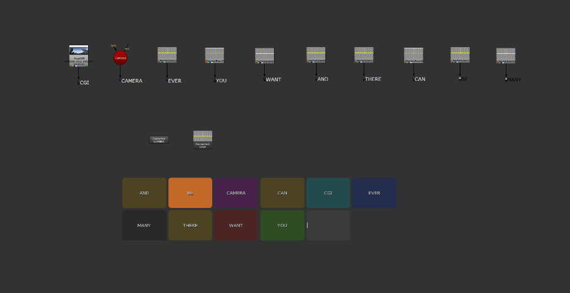
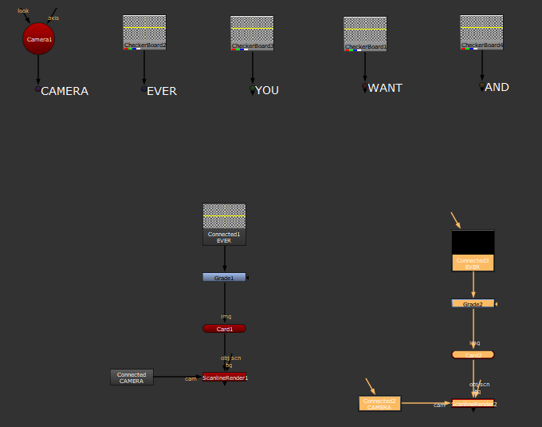
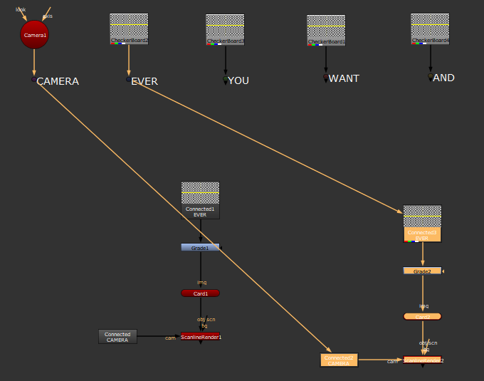

# LabelConnector
Connect Nodes via label-matching. Super light-weight without callbacks.

## Quick Manual

**F9** - created new Connector Dot using a selected Dot (or any other node, then it creates new Dot). Alternatively, it will rename an existing selected Connector Dot alongside all dependend Nodes.

**F8** - connects all label matches when mutliple nodes selected, not showing the Connector UI. Alternatively creates new connection with single empty labeled node selected, showing the Connector UI. With no selection, it will create a new PostageStamp/NoOp showing the Connector UI.
 
**ctrl+F8** - when a single alrady labeled node is selected, this will force to make a new connection instead of connecting the existing label match.

Feel free to color your Connector Dots, these colors will then appear in the Connector UI.

## Example

Select any node you want to attach a Connector Dot to, press **F9**.

\
\
You can also colorize the Connector Dot - I use the super handy W_HotBox for this, but feel free to choose any Node Color. The color will be reflected in the Connector UI.

\
\
Click free DAG space, or any Node you want, and hit **F8** to set a new connection.

\
\
You can type a Connector Name or click any button. With previously no Node selected, it will create a NoOp (3D) or PostageStamp (2D).

\
\
Selecting a Connector Dot and hitting F9 again renames the Connector Dot as well as all attached Nodes.

\
\
Buttons are sorted alphabetically.

\
\
After copy-pasting a group of Nodes, they're all selected. Just hit **F8** to connect them all.

