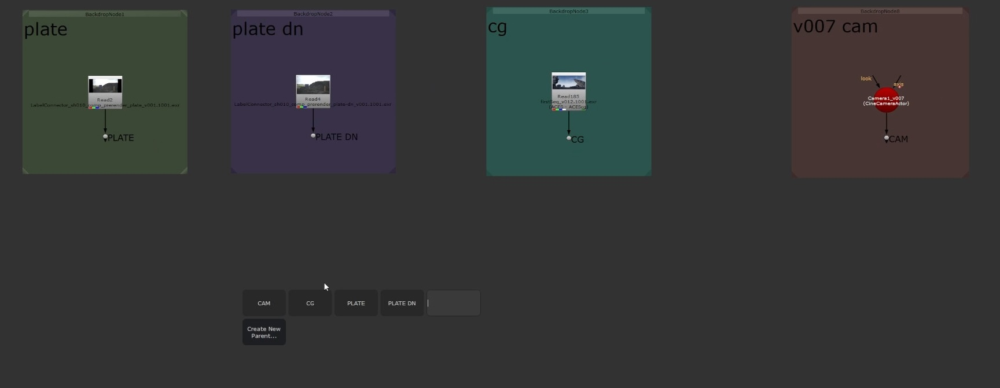
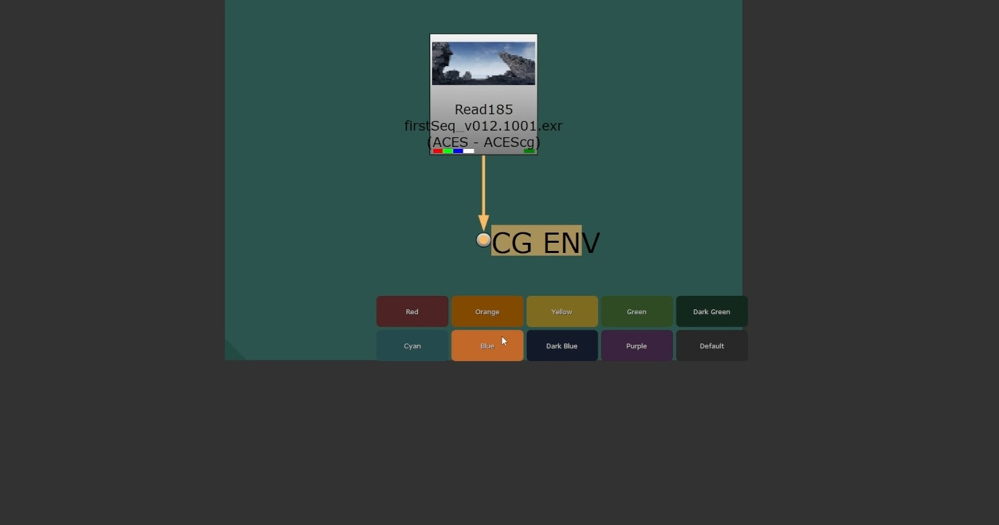
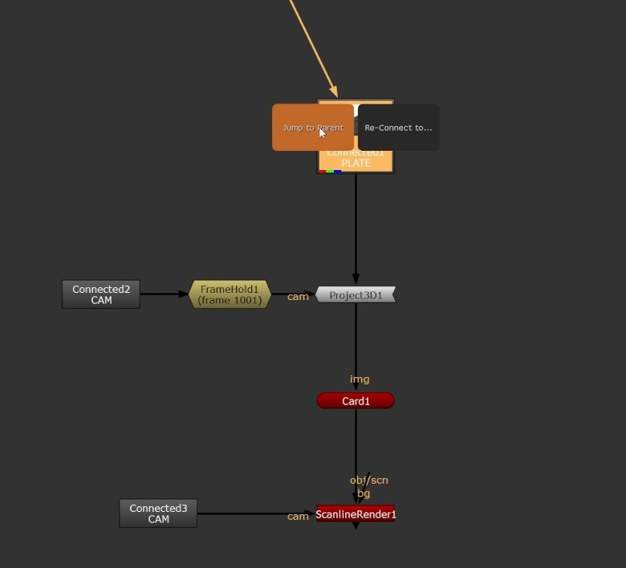
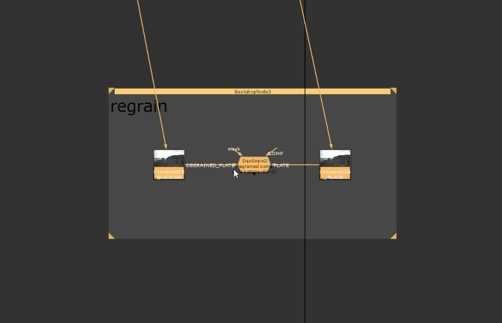

# Label Connector
A Connector Tool for Nuke with a handy UI. Super light-weight and very easy to use, just one single shortcut to create, setup, colorize and navigate these connections from anywhere in the Node Graph. No Callbacks, no hidden knobs created, to always stay compatible to other pipelines, or artists not having the Label Connector.

Demo Video:
https://youtu.be/KIwTWMKP2u0


## Quick Manual


**Default Shortcut: A** - easily change this in the included menu.py. Use it to
- create Parents, where you want to be able to connect to from anywhere
- show possible Connections
- jump to Parents or see all Children
- colorize Parents to quickly identify them again
- rename Parents, and alongside all Childrens

**Shift-Click:** Jumps directly to Connector. \
**Alt-Click:** Opens Connector Settings, same like having the parent selected.

Based on the Node Selection, it will (should :) ) provide the options you need. If not, or you are missing something, please feel free to always reach out, I'm happy about any kind of feedback. :)

---
To install the plugin, just add

```
nuke.pluginAddPath('path_to_this_folder/LabelConnector')
```
to your menu.py in your Nuke User Folder.

Thanks to Johannes Hezer for the base and Falk Hofmann for helping with the UI and code clean up.


## Version

- v1.5: Shift-Click jumps. Alt-Click modifies Parent. Highlighting search results.  

- v1.4: Big overhaul, reducing to one shortcut only while adding more functionality directly to the tool, like Colorization and Navigation. 

- v1.3: Option to choose if PostageStamps should be used or not. Also, determination if a PostageStamp is possible or it needs to be 3D compatible is now more bullet proof. 

- v1.2: Never connect certain Nodes like Reads, Backdrops, ... Yes, apparently it's possible ;)

- v1.1: Default shortcuts are now way easier to reach. Less hand movement, more happy comping! =)

- v1.0: initial release

## Examples






