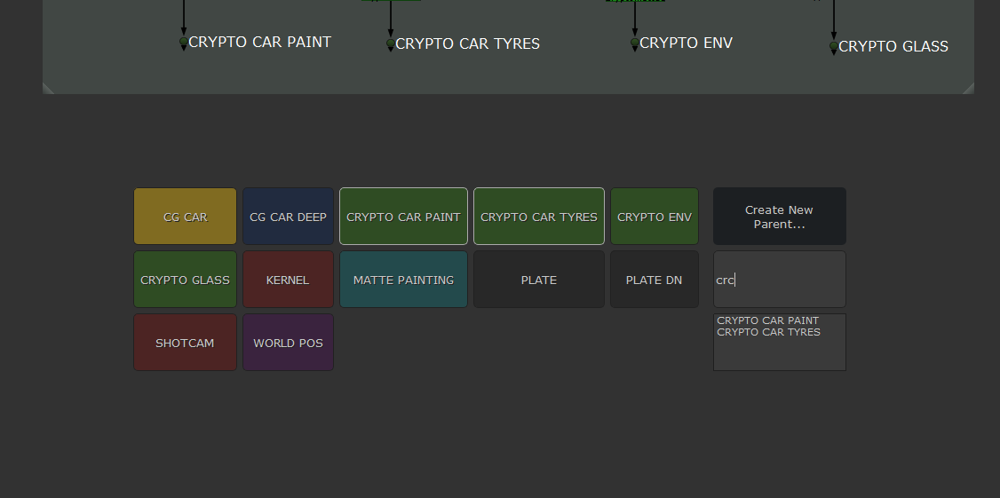
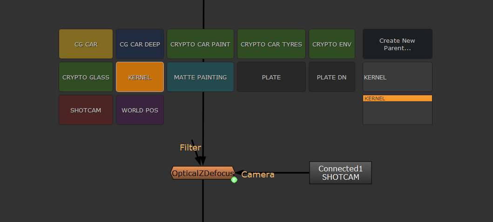
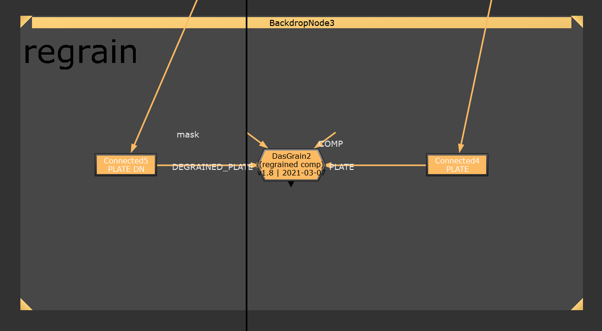
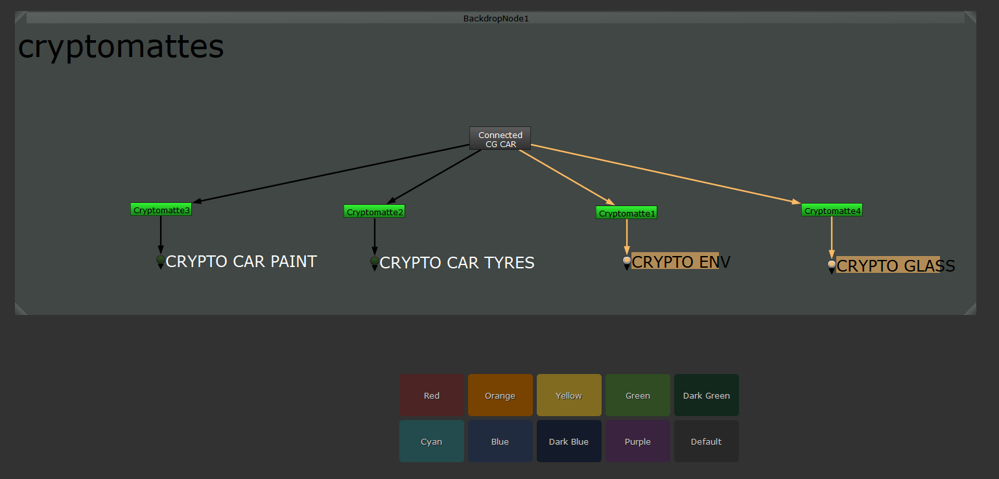
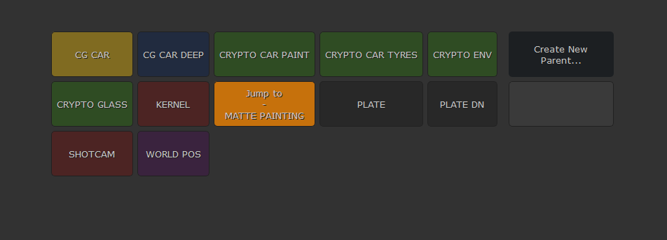
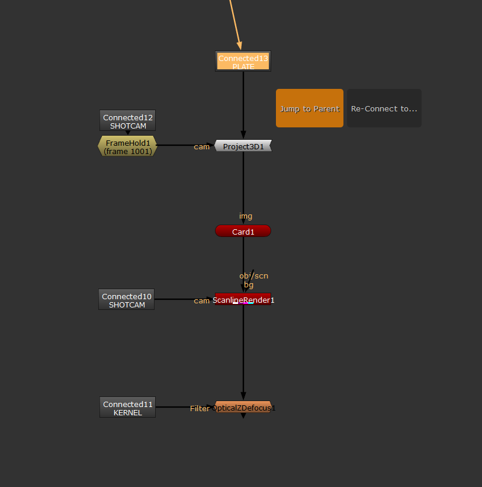
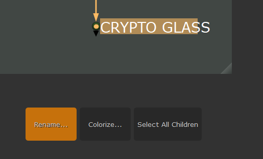
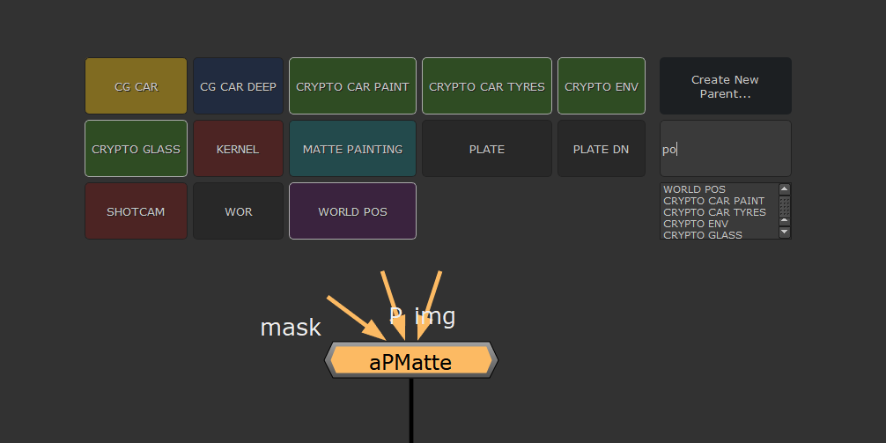

# DISCLAIMER
There is a more recent and further development of this plugin, that merges best of both worlds of the glorious Stamps and this tool.
https://github.com/luckyspacetraveller/Stamps

# Label Connector
A Connector Tool for Nuke with a handy UI. Super light-weight and very easy to use, just one single shortcut to create, setup, colorize and navigate these connections from anywhere in the Node Graph. No Callbacks, no hidden knobs created, to always stay compatible to other pipelines, or artists not having the Label Connector.

Demo Video:
https://youtu.be/KIwTWMKP2u0




## Quick Manual


**Default Shortcut: A** - easily change this in the included menu.py. Use it to
- create Parents, where you want to be able to connect to from anywhere
- show possible Connections
- jump to Parents or see all Children
- colorize Parents to quickly identify them again
- rename Parents, and alongside all connected Childrens

### Shortcuts
In the UI you can

**SHIFT + CLICK:** Jumps directly to Connector.\
**ALT + CLICK:** Opens Connector Settings, same like having a Parent selected.\
**CTRL:** Creates parent (same like clicking the "Create Parent"-button)

### Quick Tips / FAQ
- after Copy-Pasting Nodes, they are all still selected. Hit the Shortcut right away to connect them all.
- you can always select all Nodes in the DAG, and hit the Shortcut to connect everything that might got loose.
- searching works like Nukes Node Menu, just hit some characters. E.g. searching "ce" will give you "CRYPTO ENV".
- Arrow Up/Down navigates search results. Hitting Enter/Tab always selects the first one, no need to arrow down.
- fastest way to create a new Parent is typing the desired name directly into the search bar. Hitting "Create Parent" (or CTRL) gives the new Parent right away.
- Copy-Pasting and connecting works across multiple scripts, as long as the Parents have the same Label.
- give your Parents some colors. It works with multiple Parents selected at once.
- the given colors are just some quick-use presets. You can choose any color you want for your Parent, or built your own selection using the one and only amazing W_HotBox.
- creating Parents with a Node selected will append the new Node. Dots will get converted.
- creating Childrens with a Node selected will prepend a new NoOp/PostageStamp to make the connection.
- label any Dots like you want, they won't get shown in the Label Connector. Parents have a Name starting "Connector.." to identify them.
- the UI is context-based. Just give it a try, to hit the shortcut with Parents or Childrens selected, or use the Shortcuts mentioned above to get even faster.
- avoid duplicate Parents with the same Label.
- creates only NoOp Nodes by default, way better performance in big scripts :). If you want PostageStamps, easily change it in the included menu.py.

## Installation
To install the plugin, just add

```
nuke.pluginAddPath('path_to_folder_containing/LabelConnector')
```
to your menu.py in your Nuke User Folder.

Thanks to Johannes Hezer for the base and Falk Hofmann for helping with the UI and code clean up.

## Examples

\
\
Quickly get anything you need from anywhere, just use the search to find it faster. Every Match gets highlighted accordingly to guide your eyes. Hit Enter or Tab right away, or use the arrow keys to select another search result.
<br>
<br>

\
Create yourself snippets, that incorporate the Children. Copy-Paste them around, even to other Scripts.
<br>
<br>

\
Colorize Parents quickly like you want.
<br>
<br>

\
SHIFT+Click lets you navigate the DAG super fast. ALT+Click lets you e.g. colorize directly as well.
<br>
<br>

\
You can also jump from any Children.
<br>
<br>

\
Anything changed, just rename. It renames every Child accordingly.
<br>
<br>

\
Having a Node selected will prepend a Children to build the connection. Just search for it, if it is on top, hit Enter/Tab. 

## Version History

- v1.5: SHIFT+CLICK jumps. ALT+CLICK modifies Parent. CTRL creates New Parent. Search results get highlighted. More flexible search results, now with single character matching. NoOp-Nodes are default now.

- v1.4: Big overhaul, reducing to one shortcut only while adding more functionality directly to the tool, like Colorization and Navigation. 

- v1.3: Option to choose if PostageStamps should be used or not. Also, determination if a PostageStamp is possible or it needs to be 3D compatible is now more bullet proof. 

- v1.2: Never connect certain Nodes like Reads, Backdrops, ... Yes, apparently it's possible ;)

- v1.1: Default shortcuts are now way easier to reach. Less hand movement, more happy comping! =)

- v1.0: initial release
